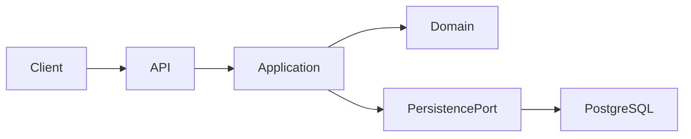

---

name: inventoryiq
description: Project-specific guidance for understanding, implementing, documenting, and evolving InventoryIQ. Use this skill when working on InventoryIQ architecture, backend features, documentation, Mermaid diagrams, roadmap items, tests, or project structure.
----------------------------------------------------------------------------------------------------------------------------------------------------------------------------------------------------------------------------------------------------------------------

# InventoryIQ Project Skill

## 1. Purpose

This skill provides project-specific context and rules for working on **InventoryIQ**.

InventoryIQ is a software project focused on inventory intelligence: helping answer:

* What should the supermarket buy?
* When should it buy it?
* How much should it buy?

The project is expected to evolve toward a system that combines inventory data, sales data, ETL, analytics, forecasting, and replenishment recommendations.

This skill exists to ensure that development and documentation remain consistent with the actual state of the repository.

---

# 2. Source of Truth

When determining whether something exists or is implemented, use the following priority order:

1. Source code
2. Automated tests
3. Build configuration and project configuration
4. Existing project documentation
5. Roadmaps and proposals

The repository's code is the source of truth for implementation status.

Documentation describes intent, design, decisions, and planned functionality. It must not be treated as proof that a feature exists.

Never claim that a feature is implemented solely because it appears in `docs/`.

---

# 3. Implementation Status

Every architectural or functional element discovered during analysis must be classified as one of:

## IMPLEMENTADO

Use when the functionality can be verified in the repository's source code and/or tests.

Evidence must point to concrete implementation.

Examples:

* existing controller
* existing service
* existing domain model
* existing repository
* existing database migration
* existing automated test
* existing API endpoint

## PLANIFICADO

Use when the functionality is explicitly intended to be implemented in the roadmap or project documentation but does not currently exist in the codebase.

Do not describe planned functionality as implemented.

## PROPUESTO

Use when the functionality is a recommendation or architectural suggestion that is not explicitly implemented or necessarily committed to by the existing roadmap.

Proposals must be clearly separated from existing project decisions.

---

# 4. Existing Documentation

The `docs/` directory currently contains documentation related to:

* InventoryIQ project/product/architecture documentation
* InventoryIQ implementation roadmap
* Simulated CSV data

Relevant files include:

* `docs/InventoryIQ_Documentacion.md`
* `docs/InventoryIQ_Roadmap.md`
* `docs/README_datos_simulados.md`

Before proposing architectural changes, inspect these documents and compare them against the current implementation.

Do not silently modify project decisions documented there.

---

# 5. Architecture Principles

InventoryIQ should follow these architectural principles unless the existing implementation explicitly requires otherwise.

## Hexagonal Architecture

Prefer Ports & Adapters.

The core domain and application logic must not depend directly on infrastructure concerns.

Conceptually:

```text
Adapters
   ↓
Ports
   ↓
Application
   ↓
Domain
```

Infrastructure implementations should depend toward the application/domain abstractions rather than the opposite.

---

## Domain-Driven Design

Use DDD concepts where they provide real value.

Pay particular attention to:

* entities
* value objects
* aggregates
* aggregate boundaries
* domain services
* repositories
* domain invariants
* application services/use cases

Do not introduce DDD patterns mechanically.

The model should reflect actual inventory/business concepts.

---

## Clean Architecture

Keep business rules independent from:

* HTTP
* databases
* frameworks
* external services
* infrastructure details

Framework-specific code should remain at the appropriate boundary.

---

## Vertical Slices

Organize functionality around use cases/capabilities where practical.

A feature should be traceable from:

```text
API / Adapter
    ↓
Application Use Case
    ↓
Domain
    ↓
Port
    ↓
Infrastructure Adapter
```

Avoid creating artificial abstractions merely for architectural appearance.

---

# 6. Backend Technology

The backend currently uses the Java/Spring ecosystem.

Relevant technologies include:

* Java 17
* Spring Boot
* Spring Data JPA
* Hibernate
* Spring Security
* REST APIs
* PostgreSQL
* Maven
* MapStruct
* Lombok
* JWT-based authentication where applicable

When modifying the backend:

1. Inspect the existing implementation first.
2. Follow existing project conventions.
3. Avoid unnecessary architectural rewrites.
4. Preserve existing behavior unless the task explicitly requests a change.
5. Add or update tests for behavior that changes.

---

# 7. DTO and Mapping Rules

The API boundary should use DTOs rather than exposing persistence/domain objects directly when the existing architecture requires separation.

MapStruct is preferred for deterministic DTO mapping.

Avoid introducing:

* manual mapping duplicated across multiple classes
* unnecessary bidirectional relationships
* circular object graphs
* persistence entities directly as API contracts

When changing a DTO:

1. Inspect the corresponding entity/domain model.
2. Inspect its mapper.
3. Inspect consumers of the DTO.
4. Inspect tests.
5. Check serialization implications.

---

# 8. Database and Persistence

PostgreSQL is part of the project's data infrastructure.

When modifying persistence:

* inspect the existing schema first;
* inspect entities and relationships;
* inspect repositories;
* inspect migrations/configuration if present;
* preserve existing constraints and invariants;
* avoid introducing circular persistence relationships without a concrete reason.

Do not modify database architecture merely to satisfy a documentation diagram.

---

# 9. Testing

Tests are evidence of actual behavior.

When implementing a feature:

1. Identify existing tests related to the feature.
2. Add tests for new behavior.
3. Run the relevant test suite.
4. Report the actual result.

Never claim tests pass without running them.

When reporting implementation status, distinguish:

```text
IMPLEMENTADO
Tests: PASS
```

from:

```text
IMPLEMENTADO
Tests: NOT RUN
```

and:

```text
PLANIFICADO
Tests: NOT APPLICABLE
```

---

# 10. Change Discipline

Before changing code:

1. Inspect the repository structure.
2. Inspect relevant source files.
3. Inspect relevant tests.
4. Inspect relevant documentation.
5. Identify existing architectural conventions.
6. Determine whether the requested feature is IMPLEMENTADO, PLANIFICADO, or PROPUESTO.
7. Make the smallest coherent change necessary.

Do not perform unrelated refactors.

Do not rename existing concepts without a concrete reason.

Do not replace existing architecture simply because another architecture appears cleaner in isolation.

---

# 11. Documentation Workflow

When asked to document InventoryIQ, follow this process.

## Step 1 — Audit

Inspect:

```text
src/
test/
pom.xml
docs/
configuration files
database configuration
```

and any other relevant project directories.

## Step 2 — Compare

Compare:

```text
CODE
TESTS
CONFIGURATION
DOCUMENTATION
ROADMAP
```

Identify contradictions.

## Step 3 — Classify

Classify every important component as:

* IMPLEMENTADO
* PLANIFICADO
* PROPUESTO

## Step 4 — Document

Only after the audit should architectural documentation be generated or updated.

Documentation must reflect reality.

---

# 12. Mermaid Architecture Documentation

When requested to generate architecture diagrams, prefer Mermaid.

Possible diagrams include:

* system context
* container/component architecture
* backend architecture
* domain model
* dependency relationships
* request flow
* data flow
* ETL pipeline
* deployment architecture

Example:



Diagrams must represent the audited implementation.

If something is planned rather than implemented, make that distinction explicit in the diagram or accompanying text.

Never create a diagram that visually presents planned components as currently deployed/implemented.

---

# 13. Architecture Documentation Rules

When generating architecture documentation, prefer this structure:

```text
# Architecture

## Current State

### IMPLEMENTADO

Components verified in the repository.

### PLANIFICADO

Components described by the roadmap but not yet implemented.

### PROPUESTO

Potential future improvements that are not established project decisions.

## Architecture Diagram

Mermaid diagram representing the current state.

## Component Responsibilities

...

## Data Flow

...

## Architectural Decisions

...

## Known Gaps

...

## Planned Evolution

...
```

The current-state diagram must not include unimplemented components unless they are explicitly marked as planned.

---

# 14. ETL and Data Intelligence

InventoryIQ is intended to work with inventory/sales data and evolve toward data-driven replenishment.

The project may contain:

* simulated CSV data
* ETL processes
* PostgreSQL
* analytical processing
* forecasting
* inventory intelligence
* replenishment recommendations

Do not assume that all of these are currently implemented.

Verify each one against the repository.

The existence of `docs/README_datos_simulados.md` indicates documentation around simulated data, not necessarily a complete production ETL pipeline.

---

# 15. Business Domain

The central business problem is:

> What should the supermarket buy, when should it buy it, and in what quantity?

Potential domain concepts may include:

* products
* stock
* sales
* inventory movements
* stockouts
* overstock
* demand
* replenishment
* suppliers
* purchase recommendations

These concepts must only be introduced into the implemented architecture when supported by the actual code or an explicit implementation task.

---

# 16. Working With the Roadmap

The roadmap is not implementation evidence.

When a roadmap item is requested:

1. Locate the item.
2. Inspect the repository.
3. Determine what already exists.
4. Determine what is missing.
5. Implement only the requested scope.
6. Update documentation if requested.
7. Run tests.
8. Report what changed.

Use this reporting format:

```text
Status: IMPLEMENTADO

Implemented:
- ...

Not implemented:
- ...

Tests:
- X/X passing

Documentation:
- ...
```

---

# 17. Forbidden Assumptions

Do not assume:

* a documented endpoint exists;
* a documented database table exists;
* a documented service exists;
* a planned architecture has already been implemented;
* a roadmap item has already been completed;
* a Mermaid diagram is evidence of implementation;
* a passing build means the entire system is complete;
* an architectural pattern is present merely because documentation mentions it.

Always verify.

---

# 18. When Asked to Implement Something

Use this workflow:

```text
Understand request
      ↓
Inspect repository
      ↓
Inspect relevant documentation
      ↓
Inspect tests
      ↓
Identify current implementation
      ↓
Plan minimal change
      ↓
Implement
      ↓
Test
      ↓
Review diff
      ↓
Report result
```

Before modifying files, identify which files are expected to change.

After implementation, inspect the final diff.

Do not modify unrelated files.

---

# 19. Communication Rules

When reporting work:

* Be precise.
* State what was actually changed.
* Separate implementation from intention.
* Mention tests and their actual results.
* Mention relevant limitations.
* Do not claim certainty without repository evidence.

Prefer:

```text
The roadmap describes X as planned, but there is currently no implementation in src/.
```

over:

```text
X is part of the architecture.
```

Prefer:

```text
X is implemented in the repository and covered by Y tests.
```

when implementation has actually been verified.

---

# 20. Primary Objective

The objective of this skill is to keep InventoryIQ internally consistent.

The assistant must continuously maintain the distinction between:

```text
WHAT EXISTS
    ↓
IMPLEMENTADO

WHAT THE PROJECT INTENDS TO BUILD
    ↓
PLANIFICADO

WHAT THE ASSISTANT RECOMMENDS
    ↓
PROPUESTO
```

When these categories conflict, the repository's actual implementation takes precedence for statements about the current system.
