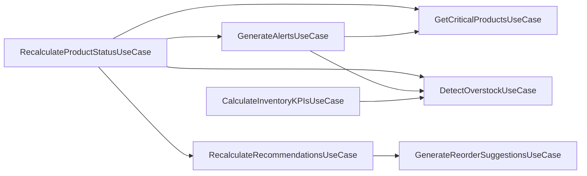
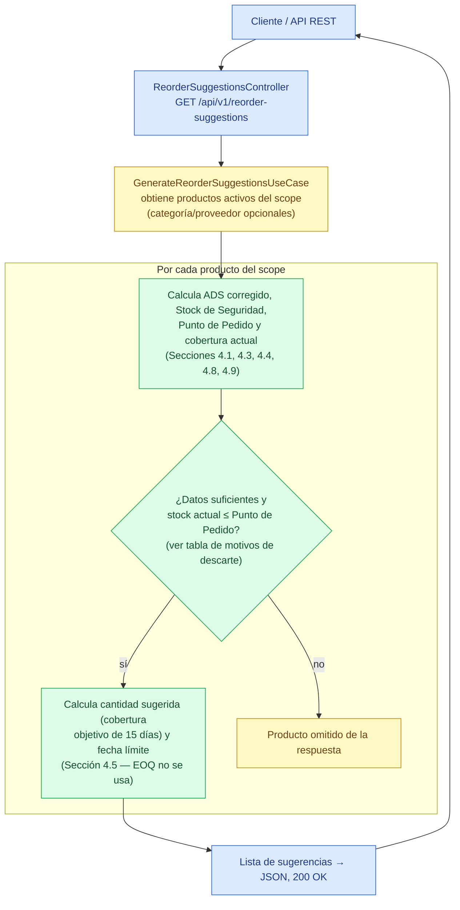
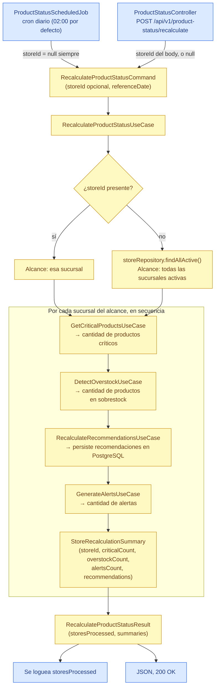
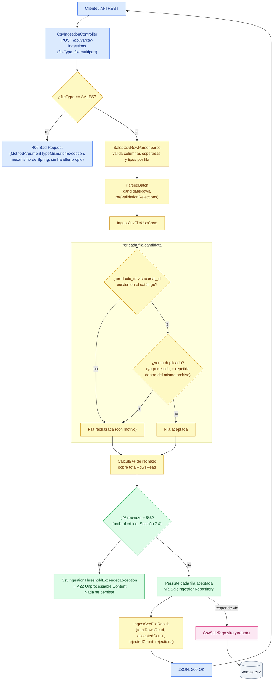
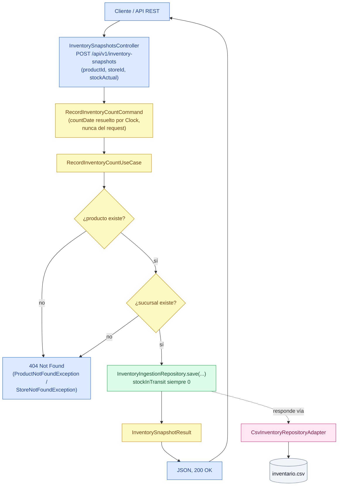
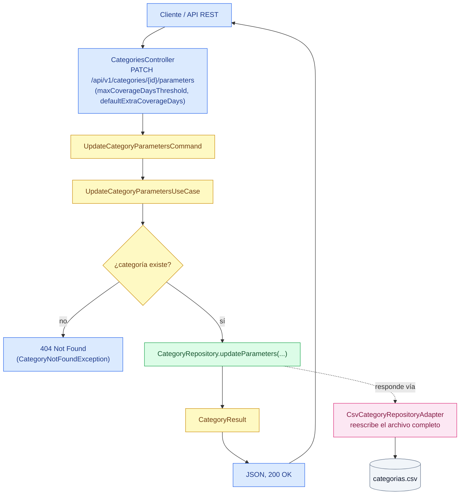

# InventoryIQ — Arquitectura Implementada

Este documento representa exclusivamente el estado **IMPLEMENTADO y verificable** del repositorio en el momento de esta auditoría. No incluye funcionalidades PLANIFICADAS (definidas en `docs/InventoryIQ_Documentacion.md` o `docs/InventoryIQ_Roadmap.md` pero aún sin código) ni PROPUESTAS. Cada componente y relación fue verificado directamente contra el código fuente, la configuración y las migraciones del backend.

Se organiza en dos niveles: la Sección 1 da la vista general por capas del backend; las Secciones 2 a 5 detallan, punta a punta, los cuatro flujos de negocio más relevantes para entender cómo se orquestan casos de uso, dominio y adaptadores en la práctica.

---

## 1. Vista general por capas

La arquitectura por capas (Entrada → Application → Domain → Salida) se documenta en tablas en vez de en un diagrama: con 15 controllers, 16 use cases, 8 output ports y 13 servicios de dominio, un diagrama que los incluya a todos deja de ser legible sin importar cuánto se colapse. El único diagrama de esta sección es el de orquestación entre casos de uso, porque es la única relación de esa capa que una tabla no muestra bien.

### 1.1 Diagrama de orquestación entre casos de uso

Algunos casos de uso no llaman directamente a un Output Port: invocan a otro caso de uso, que resuelve el acceso a datos por ellos. Esta relación es arquitectónicamente relevante (indica acoplamiento entre slices) y es más clara como grafo que como tabla.

### 1.2 Alcance

Esta documentación representa la arquitectura actualmente implementada del **backend** de InventoryIQ y sus adaptadores: la capa REST, la Application Layer (Input Ports, Use Cases y Output Ports), el núcleo de Domain, los adaptadores de salida CSV y PostgreSQL, la configuración/wiring de Spring y el job programado.

Queda explícitamente **fuera de alcance** de este documento (que solo cubre backend) el frontend React — que ya no es un scaffold vacío: tiene 9 pantallas funcionando (Inicio, Alertas, Productos Críticos, Sobrestock, Recomendaciones, Detalle de Producto, Clasificación ABC/XYZ, Proveedores, Administración) consumiendo esta misma API — ver `docs/InventoryIQ_Roadmap.md` (Fase 5) para el detalle de su stack —, pero su arquitectura interna no se documenta acá.

También queda fuera por no tener evidencia de implementación en el repositorio: el proceso ETL (Python + Pandas), el Data Warehouse en modelo estrella, y cualquier otra funcionalidad descrita en `docs/InventoryIQ_Documentacion.md` o `docs/InventoryIQ_Roadmap.md` que aún no exista en código (por ejemplo: ingesta CSV de compras/inventario/productos/proveedores — hoy limitada a `SALES`; catálogo y análisis de proveedores; persistencia de la clasificación ABC/XYZ; configuración de parámetros de categoría vía API).

Todo componente listado en las tablas siguientes es **IMPLEMENTADO**, verificado contra código fuente, configuración de Spring y migraciones Flyway existentes.

### 1.3 Tabla — Adaptadores de Entrada

| Componente | Trigger | Use Case(s) invocado(s) |
|---|---|---|
| `AlertsController` | `GET /api/v1/alerts` | `GenerateAlertsUseCase` |
| `CriticalProductsController` | `GET /api/v1/products/critical` | `GetCriticalProductsUseCase` |
| `CsvIngestionController` | `POST /api/v1/csv-ingestions` (multipart, vía `SalesCsvRowParser`) | `IngestCsvFileUseCase` |
| `ForecastController` | `GET /api/v1/products/{productId}/forecast` | `ForecastDemandUseCase` |
| `HealthController` | `GET /health` | — (no invoca casos de uso) |
| `KPIsController` | `GET /api/v1/kpis` | `CalculateInventoryKPIsUseCase` |
| `OverstockController` | `GET /api/v1/products/overstock` | `DetectOverstockUseCase` |
| `ProductClassificationController` | `GET /api/v1/products/classification` | `ClassifyProductsUseCase` |
| `ProductStatusController` | `POST /api/v1/product-status/recalculate` | `RecalculateProductStatusUseCase` |
| `RecommendationsController` | `GET /api/v1/recommendations`, `POST /api/v1/recommendations/recalculate`, `PATCH /api/v1/recommendations/{id}` | `ListRecommendationsUseCase`, `RecalculateRecommendationsUseCase`, `RegisterRecommendationFeedbackUseCase` |
| `ReorderSuggestionsController` | `GET /api/v1/reorder-suggestions` | `GenerateReorderSuggestionsUseCase` |
| `StoresController` | `GET /api/v1/stores` | `ListStoresUseCase` |
| `CategoriesController` | `GET /api/v1/categories`, `PATCH /api/v1/categories/{id}/parameters` | `ListCategoriesUseCase`, `UpdateCategoryParametersUseCase` |
| `ProductSearchController` | `GET /api/v1/products?q=...` | `SearchProductsUseCase` |
| `InventorySnapshotsController` | `POST /api/v1/inventory-snapshots` | `RecordInventoryCountUseCase` |
| `SuppliersController` | `GET /api/v1/suppliers`, `PATCH /api/v1/suppliers/{id}/lead-time` | `ListSuppliersUseCase`, `UpdateSupplierLeadTimeUseCase` |
| `ProductStatusScheduledJob` | cron (`inventoryiq.scheduling.recalculate-product-status-cron`, default `0 0 2 * * *`) | `RecalculateProductStatusUseCase` |

`GlobalExceptionHandler` (`@RestControllerAdvice`) traduce las excepciones de dominio lanzadas por cualquiera de estos flujos a códigos HTTP (400/404/422), de forma transversal.

### 1.4 Tabla — Use Cases

| Use Case | Output Ports usados | Servicios de dominio clave | Orquesta a |
|---|---|---|---|
| `GetCriticalProductsUseCase` | Product, Category, Sale, Inventory | `AbcClassifier`, `CriticalityEvaluator`, `ProductIndicatorsCalculator` | — |
| `DetectOverstockUseCase` | Product, Category, Sale, Inventory | `ProductIndicatorsCalculator` | — |
| `ClassifyProductsUseCase` | Product, Sale, Inventory | `AbcClassifier`, `XyzClassifier`, `DemandStatistics`, `DailySalesRecordAssembler` | — |
| `GenerateAlertsUseCase` | — | — | `GetCriticalProductsUseCase`, `DetectOverstockUseCase` |
| `GenerateReorderSuggestionsUseCase` | Product, Category, Sale, Inventory | `ReorderPointCalculator`, `RecommendedQuantityCalculator`, `ProductIndicatorsCalculator` | — |
| `ForecastDemandUseCase` | Product, Sale, Inventory | `AdsCalculator`, `DailySalesRecordAssembler`, `SeasonalityCalculator` | — |
| `ListRecommendationsUseCase` | Recommendation, Product | — | — |
| `RecalculateRecommendationsUseCase` | Recommendation | — | `GenerateReorderSuggestionsUseCase` |
| `RegisterRecommendationFeedbackUseCase` | Recommendation, Product | — | — |
| `CalculateInventoryKPIsUseCase` | Product, Category, Sale, Inventory, Recommendation | `InventoryTurnoverCalculator`, `ProductIndicatorsCalculator` | `DetectOverstockUseCase` |
| `IngestCsvFileUseCase` | Product, Store, SaleIngestion | — | — |
| `RecalculateProductStatusUseCase` | Store | — | `GetCriticalProductsUseCase`, `DetectOverstockUseCase`, `RecalculateRecommendationsUseCase`, `GenerateAlertsUseCase` |
| `ListStoresUseCase` | Store | — | — |
| `ListCategoriesUseCase` | Category | — | — |
| `UpdateCategoryParametersUseCase` | Category | — | — |
| `SearchProductsUseCase` | Product | — | — |
| `RecordInventoryCountUseCase` | Product, Store, InventoryIngestion | — | — |
| `ListSuppliersUseCase` | Supplier | — | — |
| `UpdateSupplierLeadTimeUseCase` | Supplier | — | — |

`ProductIndicatorsCalculator` es un helper compartido (`usecase/shared`), no un Output Port ni un servicio de dominio propio; internamente usa `AdsCalculator`, `DailySalesRecordAssembler`, `OverstockDetector`, `ProductStatusEvaluator`, `ReorderPointCalculator` y `SafetyStockCalculator`.

### 1.5 Tabla — Output Ports → Adaptador de Salida

| Output Port | Adaptador | Origen de datos |
|---|---|---|
| `ProductRepository` | `CsvProductRepositoryAdapter` | `productos.csv` |
| `CategoryRepository` | `CsvCategoryRepositoryAdapter` | `categorias.csv` |
| `SaleRepository` / `SaleIngestionRepository` | `CsvSaleRepositoryAdapter` (implementa ambos) | `ventas.csv` |
| `InventoryRepository` / `InventoryIngestionRepository` | `CsvInventoryRepositoryAdapter` (implementa ambos) | `inventario.csv` |
| `StoreRepository` | `CsvStoreRepositoryAdapter` | `sucursales.csv` |
| `SupplierRepository` | `CsvSupplierRepositoryAdapter` | `proveedores.csv` |
| `RecommendationRepository` | `PostgresRecommendationRepositoryAdapter` (JdbcTemplate) | tabla `recommendations` (Flyway `V1__create_recommendations_table.sql`) |

---

## 2. Flujo: Generación de sugerencias de reposición

Flujo del caso de uso `GenerateReorderSuggestionsUseCase` (impl: `GenerateReorderSuggestionsService`). No incluye pasos ni cálculos descritos en `docs/InventoryIQ_Documentacion.md` sin evidencia en código (por ejemplo, EOQ no participa de este flujo, y este caso de uso no persiste ninguna recomendación).

### 2.1 Motivos de descarte

El nodo `GATE` colapsa cuatro condiciones independientes que en el código son chequeos separados, pero todas producen el mismo efecto (el producto no aparece en la respuesta):

| Condición evaluada | Efecto |
|---|---|
| `AdsCalculator` sin historial de ventas suficiente | Descartado |
| Sin snapshot de inventario vigente (`findLatestSnapshotAsOf`) | Descartado |
| Categoría del producto no encontrada | Descartado |
| Stock actual > Punto de Pedido (`ReorderPointCalculator.requiresReplenishment` = false) | Descartado (no requiere reposición) |

Este último caso es la regla de disparo exacta de la Sección 4.4: `stock actual ≤ punto de pedido`. Los otros tres son casos de datos insuficientes que impiden calcular con confianza.

### 2.2 Acceso a datos

`CALC` obtiene ventas y snapshots de inventario de los últimos 90 días, y `UC`/`CALC` consultan productos y categorías, todo a través de los Output Ports de la Sección 1.5 — resueltos hoy por los adaptadores CSV (`productos.csv`, `categorias.csv`, `ventas.csv`, `inventario.csv`).

### 2.3 Notas sobre el detalle omitido

- **`CALC`** colapsa la construcción del historial diario (`DailySalesRecordAssembler`) y cuatro cálculos secuenciales: `AdsCalculator`, `SafetyStockCalculator.calculateSimplifiedMethod`, `ReorderPointCalculator.calculate` y `OverstockDetector.calculateCurrentDaysOfCoverage`. También se calcula `ProductStatusEvaluator.evaluate`, aunque este flujo no lo usa para filtrar.
- La validación de `storeId`/`referenceDate` nulos en `GenerateReorderSuggestionsQuery` (→ 400 Bad Request) y el detalle de `RecommendedQuantityCalculator.calculateByTargetCoverage` (Sección 4.5) se documentan aquí en texto en lugar de como nodos propios.
- El `supplierId` del resultado se propaga tal cual desde `Product.supplierId()`, sin resolverlo contra un `SupplierRepository` (ese puerto no existe en el repositorio).

---

## 3. Flujo: Recálculo de estado de productos

Flujo del caso de uso `RecalculateProductStatusUseCase` (impl: `RecalculateProductStatusService`). Es el orquestador final del proyecto: dispara, en secuencia, a `GetCriticalProductsUseCase`, `DetectOverstockUseCase`, `RecalculateRecommendationsUseCase` y `GenerateAlertsUseCase` por cada sucursal en alcance.

**Nota importante de alcance:** este caso de uso no persiste una tabla de "estado de producto" propia. El único efecto persistido real es el que ya cubre `RecalculateRecommendationsUseCase` (recomendaciones en PostgreSQL). Los otros tres casos de uso se recalculan al vuelo, igual que en el resto del proyecto — se corren acá para completar el resumen del job, no porque tengan un efecto secundario propio que persistir.

### 3.1 Notas sobre el detalle omitido

- El orden `Critical → Overstock → RecalculateRecommendations → Alerts` es literal del cuerpo de `recalculateForStore` en `RecalculateProductStatusService`, no una inferencia.
- Cada uno de los cuatro pasos internos del loop es en sí mismo un caso de uso completo con su propio flujo de datos (ver Sección 1.4, y la Sección 2 de este documento para el detalle de `GenerateReorderSuggestionsUseCase`, invocado a su vez por `RecalculateRecommendationsUseCase`).
- `referenceDate` nunca lo elige quien dispara el flujo: el job lo resuelve con `LocalDate.now(clock)` y el controller REST hace lo mismo — no es un parámetro de request en ningún trigger.
- No existe endpoint documentado en la Sección 8 de `InventoryIQ_Documentacion.md` para este caso de uso; `ProductStatusController` se diseñó en este slice para poder disparar el job manualmente, además del trigger programado real.

---

## 4. Flujo: Ingesta de archivos CSV (ventas)

Flujo del caso de uso `IngestCsvFileUseCase` (impl: `IngestCsvFileService`). Hoy solo existe implementación para `CsvFileType.SALES` — es el único valor del enum; ingerir compras, inventario, productos, proveedores, categorías o sucursales está fuera de alcance de este flujo.

### 4.1 Notas sobre el detalle omitido

- **`PARSE`** vive en `adapters/in/csv`, no en `application/`: valida estructura y tipos por fila (columnas esperadas, parseo de fecha/decimal/entero) apoyándose en el constructor de `Sale`, que ya verifica invariantes como `unidades_vendidas >= 0`. La integridad referencial y los duplicados quedan para la capa de aplicación, que sí tiene los puertos para resolverlos — de ahí la separación entre `PARSE` (fuera del use case) y `LOOP` (dentro).
- **`DUP`** colapsa dos chequeos independientes: `saleIngestionRepository.existsByProductStoreAndDate` (contra lo ya persistido) y una detección en memoria de duplicados dentro del mismo archivo subido (`seenInThisBatch`) — necesaria porque nada se persiste hasta el final de la corrida.
- El umbral del 5% se toma literalmente del ejemplo de la Sección 7.4 de `InventoryIQ_Documentacion.md`; no hay otro valor sugerido en la documentación, y es una constante fija en `IngestCsvFileService` (`REJECTION_THRESHOLD_PERCENT`), no configurable.
- Si se supera el umbral, la excepción se lanza **antes** del bloque de persistencia: es todo o nada por corrida, no hay persistencia parcial de las filas aceptadas hasta ese punto.

---

## 5. Flujo: Registro de conteo de stock

Flujo del caso de uso `RecordInventoryCountUseCase` (impl: `RecordInventoryCountService`). Sin endpoint documentado en la Sección 8 de `InventoryIQ_Documentacion.md` — no estaba previsto en el diseño original, que asumía un ETL automático (Sección 7) como única vía de actualización de inventario. Se agregó porque, en el proceso real relevado con el usuario, el export de stock del POS llega desactualizado (no se carga a tiempo cuando entra mercadería de un proveedor): el conteo físico manual, hecho antes de emitir un pedido, es la fuente confiable real.

### 5.1 Notas sobre el detalle omitido

- `inventoryId` no lo elige quien llama: a diferencia de una venta ingerida vía CSV (que trae su propio `venta_id` en la fila), un conteo manual no tiene un id externo — lo genera `CsvInventoryRepositoryAdapter` (máximo id existente + contador en memoria) dentro de `save()`.
- `stockInTransit` siempre se registra en `0`: un conteo físico releva lo que hay parado en el depósito/góndola, no "lo que está en camino" de un proveedor — `RecordInventoryCountCommand` ni siquiera recibe ese dato como parámetro.
- Mismo criterio de integridad referencial que `IngestCsvFileService` usa para ventas (verificar que `producto_id`/`sucursal_id` existan), pero acá cada chequeo fallido corta la ejecución con un 404 en vez de acumularse como un rechazo de fila — es un registro puntual, no un lote.
- `GET /api/v1/products?q=...` (`SearchProductsUseCase`) no tiene un flujo dedicado en este documento: es un filtro en memoria de una sola pasada sobre `ProductRepository.findAllActive()` (por código en `Product.sku` o por nombre, sin distinguir mayúsculas), sin ramas ni casos de descarte que justifiquen un diagrama propio. Lo usa la pantalla de conteo de stock del frontend para resolver un producto por código de barras, código interno corto, o nombre, sin que quien carga el dato tenga que conocer el `productId` numérico.

---

## 6. Flujo: Corrección de lead time de un proveedor

Flujo del caso de uso `UpdateSupplierLeadTimeUseCase` (impl: `UpdateSupplierLeadTimeService`). Sin endpoint documentado en el diseño original de la Sección 8 (ver 8.11 en `InventoryIQ_Documentacion.md`) — el diseño original asumía un `GET /api/v1/proveedores` de solo lectura, con lead time histórico importado de algún sistema. En el proceso real relevado con el usuario, la coordinación con proveedores es por WhatsApp y `Mantenimiento_de_Proveedores_.csv` (export real del sistema XRP) confirma que no existe ningún campo de lead time en ningún sistema — por eso el lead time se carga y corrige a mano, mismo criterio que el conteo físico de stock (Sección 5).

### 6.1 Notas sobre el detalle omitido

- A diferencia de `CsvInventoryRepositoryAdapter`/`CsvSaleRepositoryAdapter` (que solo agregan filas al final del archivo, sobre registros históricos inmutables), `CsvSupplierRepositoryAdapter.updateLeadTime()` reescribe `proveedores.csv` completo: un proveedor es una entidad mutable que se corrige, no un evento que se acumula. El orden original de las filas se preserva (`LinkedHashMap`) para que corregir un proveedor no reordene el archivo.
- `SupplierRepository` es un único puerto de salida con lectura y escritura (`findById`, `findAllActive`, `updateLeadTime`) — no está separado en un puerto de ingestión aparte como `SaleIngestionRepository`/`InventoryIngestionRepository`, porque acá no hay "ingesta" de datos nuevos, solo corrección de un dato existente. Mismo criterio que `RecommendationRepository.save()` (upsert sobre Postgres).
- `GET /api/v1/suppliers` (`ListSuppliersUseCase`) no tiene un diagrama propio: es una traducción directa de `SupplierRepository.findAllActive()`, sin ramas — mismo criterio que `ListStoresUseCase`/`ListCategoriesUseCase`.

---

## 7. Flujo: Corrección de parámetros de una categoría

Flujo del caso de uso `UpdateCategoryParametersUseCase` (impl: `UpdateCategoryParametersService`). Documentado en la Sección 8.10 del diseño original desde el inicio (a diferencia de Proveedores/Conteo de stock, no es un endpoint agregado fuera de diseño) pero marcado PLANIFICADO hasta esta implementación — las categorías eran de solo lectura.

### 7.1 Notas sobre el detalle omitido

- Mismo criterio que `CsvSupplierRepositoryAdapter` (Sección 6): `CsvCategoryRepositoryAdapter.updateParameters()` reescribe `categorias.csv` completo en vez de agregar una fila — una categoría es una entidad mutable, y el orden original se preserva con un `LinkedHashMap`. `CategoryRepository` es un único puerto con lectura y escritura, sin un puerto de ingestión separado.
- Ambos parámetros corregidos acá se leen en caliente desde `ProductIndicatorsCalculator` (helper compartido por `GetCriticalProductsUseCase`, `DetectOverstockUseCase`, `GenerateReorderSuggestionsUseCase`, etc.) en cada request — no hay caché ni estado derivado que invalidar: el efecto es inmediato.
- La reescritura normaliza el formato numérico: `categorias.csv` traía los umbrales como decimales (`"20.0"`, herencia del generador de datos simulados) y el dominio los modela como `int` (`CsvFieldParsers.parseIntFromDecimal` tolera ambos formatos al leer). Tras la primera corrección a cualquier categoría, el archivo completo queda reescrito con enteros (`"20"`) — un cambio de formato sin efecto funcional, pero visible si se compara el CSV antes/después a mano.
- `maxCoverageDaysThreshold`/`defaultExtraCoverageDays` no incluyen los pesos del score de criticidad (`CriticalityEvaluator.CriticalityWeights`, Sección 9.1): esos siguen siendo un único valor global configurado en `UseCaseConfig`, no por categoría ni vía API.
