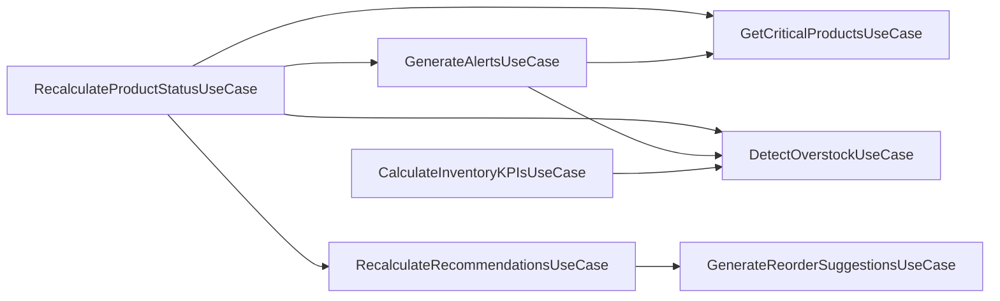

# Arquitectura actual de InventoryIQ

Este documento representa exclusivamente el estado **IMPLEMENTADO y verificable** del repositorio en el momento de esta auditoría. No incluye funcionalidades PLANIFICADAS (definidas en `docs/InventoryIQ_Documentacion.md` o `docs/InventoryIQ_Roadmap.md` pero aún sin código) ni PROPUESTAS. Cada componente y relación fue verificado directamente contra el código fuente, la configuración y las migraciones del backend.

La arquitectura por capas (Entrada → Application → Domain → Salida) se documenta en las tablas de abajo en vez de en un diagrama: con 11 controllers, 13 use cases, 7 output ports y 13 servicios de dominio, un diagrama que los incluya a todos deja de ser legible sin importar cuánto se colapse. El único diagrama de este documento es el de orquestación entre casos de uso, porque es la única relación de esa capa que una tabla no muestra bien.

## Diagrama de orquestación entre casos de uso

Algunos casos de uso no llaman directamente a un Output Port: invocan a otro caso de uso, que resuelve el acceso a datos por ellos. Esta relación es arquitectónicamente relevante (indica acoplamiento entre slices) y es más clara como grafo que como tabla.

## Alcance

Esta documentación representa la arquitectura actualmente implementada del **backend** de InventoryIQ y sus adaptadores: la capa REST, la Application Layer (Input Ports, Use Cases y Output Ports), el núcleo de Domain, los adaptadores de salida CSV y PostgreSQL, la configuración/wiring de Spring y el job programado.

Queda explícitamente **fuera de alcance** por no tener evidencia de implementación en el repositorio: el frontend React (actualmente solo el scaffold por defecto de Vite, sin componentes propios de InventoryIQ), el proceso ETL (Python + Pandas), el Data Warehouse en modelo estrella, y cualquier otra funcionalidad descrita en `docs/InventoryIQ_Documentacion.md` o `docs/InventoryIQ_Roadmap.md` que aún no exista en código (por ejemplo: ingesta CSV de compras/inventario/productos/proveedores/categorías/sucursales — hoy limitada a `SALES`; endpoints de catálogo, categorías, proveedores y sucursales; persistencia de la clasificación ABC/XYZ).

Todo componente listado en las tablas siguientes es **IMPLEMENTADO**, verificado contra código fuente, configuración de Spring y migraciones Flyway existentes. Para el detalle de un flujo de negocio punta a punta, ver los documentos de flujo específicos (`reorder-suggestions-flow.md`, `recalculate-product-status-flow.md`, `ingest-csv-file-flow.md`).

## Tabla 1 — Adaptadores de Entrada

| Componente | Trigger | Use Case(s) invocado(s) |
|---|---|---|
| `AlertsController` | `GET /api/v1/alerts` | `GenerateAlertsUseCase` |
| `CriticalProductsController` | `GET /api/v1/products/critical` | `GetCriticalProductsUseCase` |
| `CsvIngestionController` | `POST /api/v1/csv-ingestions` (multipart, vía `SalesCsvRowParser`) | `IngestCsvFileUseCase` |
| `ForecastController` | `GET /api/v1/products/{productId}/forecast` | `ForecastDemandUseCase` |
| `HealthController` | `GET /health` | — (no invoca casos de uso) |
| `KPIsController` | `GET /api/v1/kpis` | `CalculateInventoryKPIsUseCase` |
| `OverstockController` | `GET /api/v1/products/overstock` | `DetectOverstockUseCase` |
| `ProductClassificationController` | `GET /api/v1/products/classification` | `ClassifyProductsUseCase` |
| `ProductStatusController` | `POST /api/v1/product-status/recalculate` | `RecalculateProductStatusUseCase` |
| `RecommendationsController` | `GET /api/v1/recommendations`, `POST /api/v1/recommendations/recalculate`, `PATCH /api/v1/recommendations/{id}` | `ListRecommendationsUseCase`, `RecalculateRecommendationsUseCase`, `RegisterRecommendationFeedbackUseCase` |
| `ReorderSuggestionsController` | `GET /api/v1/reorder-suggestions` | `GenerateReorderSuggestionsUseCase` |
| `ProductStatusScheduledJob` | cron (`inventoryiq.scheduling.recalculate-product-status-cron`, default `0 0 2 * * *`) | `RecalculateProductStatusUseCase` |

`GlobalExceptionHandler` (`@RestControllerAdvice`) traduce las excepciones de dominio lanzadas por cualquiera de estos flujos a códigos HTTP (400/404/422), de forma transversal.

## Tabla 2 — Use Cases

| Use Case | Output Ports usados | Servicios de dominio clave | Orquesta a |
|---|---|---|---|
| `GetCriticalProductsUseCase` | Product, Category, Sale, Inventory | `AbcClassifier`, `CriticalityEvaluator`, `ProductIndicatorsCalculator` | — |
| `DetectOverstockUseCase` | Product, Category, Sale, Inventory | `ProductIndicatorsCalculator` | — |
| `ClassifyProductsUseCase` | Product, Sale, Inventory | `AbcClassifier`, `XyzClassifier`, `DemandStatistics`, `DailySalesRecordAssembler` | — |
| `GenerateAlertsUseCase` | — | — | `GetCriticalProductsUseCase`, `DetectOverstockUseCase` |
| `GenerateReorderSuggestionsUseCase` | Product, Category, Sale, Inventory | `ReorderPointCalculator`, `RecommendedQuantityCalculator`, `ProductIndicatorsCalculator` | — |
| `ForecastDemandUseCase` | Product, Sale, Inventory | `AdsCalculator`, `DailySalesRecordAssembler`, `SeasonalityCalculator` | — |
| `ListRecommendationsUseCase` | Recommendation, Product | — | — |
| `RecalculateRecommendationsUseCase` | Recommendation | — | `GenerateReorderSuggestionsUseCase` |
| `RegisterRecommendationFeedbackUseCase` | Recommendation, Product | — | — |
| `CalculateInventoryKPIsUseCase` | Product, Category, Sale, Inventory, Recommendation | `InventoryTurnoverCalculator`, `ProductIndicatorsCalculator` | `DetectOverstockUseCase` |
| `IngestCsvFileUseCase` | Product, Store, SaleIngestion | — | — |
| `RecalculateProductStatusUseCase` | Store | — | `GetCriticalProductsUseCase`, `DetectOverstockUseCase`, `RecalculateRecommendationsUseCase`, `GenerateAlertsUseCase` |

`ProductIndicatorsCalculator` es un helper compartido (`usecase/shared`), no un Output Port ni un servicio de dominio propio; internamente usa `AdsCalculator`, `DailySalesRecordAssembler`, `OverstockDetector`, `ProductStatusEvaluator`, `ReorderPointCalculator` y `SafetyStockCalculator`.

## Tabla 3 — Output Ports → Adaptador de Salida

| Output Port | Adaptador | Origen de datos |
|---|---|---|
| `ProductRepository` | `CsvProductRepositoryAdapter` | `productos.csv` |
| `CategoryRepository` | `CsvCategoryRepositoryAdapter` | `categorias.csv` |
| `SaleRepository` / `SaleIngestionRepository` | `CsvSaleRepositoryAdapter` (implementa ambos) | `ventas.csv` |
| `InventoryRepository` | `CsvInventoryRepositoryAdapter` | `inventario.csv` |
| `StoreRepository` | `CsvStoreRepositoryAdapter` | `sucursales.csv` |
| `RecommendationRepository` | `PostgresRecommendationRepositoryAdapter` (JdbcTemplate) | tabla `recommendations` (Flyway `V1__create_recommendations_table.sql`) |
