# Arquitectura actual de InventoryIQ

Este documento representa exclusivamente el estado **IMPLEMENTADO y verificable** del repositorio en el momento de esta auditoría. No incluye funcionalidades PLANIFICADAS (definidas en `docs/InventoryIQ_Documentacion.md` o `docs/InventoryIQ_Roadmap.md` pero aún sin código) ni PROPUESTAS. Cada componente y relación que aparece a continuación fue verificado directamente contra el código fuente, la configuración y las migraciones del backend.

```mermaid
flowchart TD
    CLI["Cliente / API REST<br/>(HTTP)"]

    subgraph ENTRADA["Adaptadores de Entrada"]
        direction TB
        C_Alerts["AlertsController<br/>GET /api/v1/alerts"]
        C_Critical["CriticalProductsController<br/>GET /api/v1/products/critical"]
        C_Csv["CsvIngestionController<br/>POST /api/v1/csv-ingestions"]
        C_Forecast["ForecastController<br/>GET /api/v1/products/{productId}/forecast"]
        C_Health["HealthController<br/>GET /health"]
        C_Kpi["KPIsController<br/>GET /api/v1/kpis"]
        C_Over["OverstockController<br/>GET /api/v1/products/overstock"]
        C_Class["ProductClassificationController<br/>GET /api/v1/products/classification"]
        C_Status["ProductStatusController<br/>POST /api/v1/product-status/recalculate"]
        C_Reco["RecommendationsController<br/>GET /api/v1/recommendations<br/>POST /api/v1/recommendations/recalculate<br/>PATCH /api/v1/recommendations/{recommendationId}"]
        C_Reorder["ReorderSuggestionsController<br/>GET /api/v1/reorder-suggestions"]
        C_Exc["GlobalExceptionHandler<br/>@RestControllerAdvice"]
        P_Sales["SalesCsvRowParser<br/>adapters.in.csv"]
        SCH["ProductStatusScheduledJob<br/>@Scheduled(cron)"]
    end

    subgraph APLICACION["Application Layer"]
        direction TB
        subgraph UC["Input Ports + Use Cases (impl 1:1)"]
            direction TB
            UC_Critical["GetCriticalProductsUseCase<br/>impl: GetCriticalProductsService"]
            UC_Over["DetectOverstockUseCase<br/>impl: DetectOverstockService"]
            UC_Class["ClassifyProductsUseCase<br/>impl: ClassifyProductsService"]
            UC_Alerts["GenerateAlertsUseCase<br/>impl: GenerateAlertsService"]
            UC_Reorder["GenerateReorderSuggestionsUseCase<br/>impl: GenerateReorderSuggestionsService"]
            UC_Forecast["ForecastDemandUseCase<br/>impl: ForecastDemandService"]
            UC_ListReco["ListRecommendationsUseCase<br/>impl: ListRecommendationsService"]
            UC_RecalcReco["RecalculateRecommendationsUseCase<br/>impl: RecalculateRecommendationsService"]
            UC_Feedback["RegisterRecommendationFeedbackUseCase<br/>impl: RegisterRecommendationFeedbackService"]
            UC_Kpi["CalculateInventoryKPIsUseCase<br/>impl: CalculateInventoryKPIsService"]
            UC_Ingest["IngestCsvFileUseCase<br/>impl: IngestCsvFileService"]
            UC_Status["RecalculateProductStatusUseCase<br/>impl: RecalculateProductStatusService"]
            SHARED["ProductIndicatorsCalculator<br/>usecase/shared (helper reutilizado)"]
        end

        subgraph OP["Output Ports"]
            direction TB
            OP_Prod["ProductRepository"]
            OP_Cat["CategoryRepository"]
            OP_Sale["SaleRepository"]
            OP_SaleIng["SaleIngestionRepository"]
            OP_Inv["InventoryRepository"]
            OP_Store["StoreRepository"]
            OP_Reco["RecommendationRepository"]
        end
    end

    subgraph DOMINIO["Domain"]
        direction TB
        DOM_MODEL["Modelos<br/>Product, Category, Store, Supplier, Sale,<br/>Inventory, StockMovement, Recommendation,<br/>ProductStatus, RecommendationStatus, MovementType,<br/>AbcClassification, XyzClassification"]
        DOM_VO["Value Objects<br/>LeadTime, SafetyStock, ReorderPoint,<br/>RecommendedQuantity, CriticalityLevel, DailySalesRecord"]
        DOM_SVC["Domain Services<br/>AdsCalculator, SafetyStockCalculator, ReorderPointCalculator,<br/>RecommendedQuantityCalculator, InventoryTurnoverCalculator,<br/>AbcClassifier, XyzClassifier, OverstockDetector,<br/>SeasonalityCalculator, CriticalityEvaluator,<br/>ProductStatusEvaluator, DemandStatistics, DailySalesRecordAssembler"]
        DOM_EXC["Domain Exceptions<br/>InvalidDomainDataException, NotFoundException,<br/>ProductNotFoundException, RecommendationNotFoundException,<br/>CsvIngestionThresholdExceededException"]
    end

    subgraph SALIDA_CSV["Adaptadores de Salida — CSV"]
        direction TB
        A_Prod["CsvProductRepositoryAdapter<br/>lee productos.csv"]
        A_Cat["CsvCategoryRepositoryAdapter<br/>lee categorias.csv"]
        A_Sale["CsvSaleRepositoryAdapter<br/>lee y escribe ventas.csv<br/>(implementa SaleRepository + SaleIngestionRepository)"]
        A_Inv["CsvInventoryRepositoryAdapter<br/>lee inventario.csv"]
        A_Store["CsvStoreRepositoryAdapter<br/>lee sucursales.csv"]
        A_Parser["CsvFieldParsers / CsvFileReader<br/>adapters.out.csv.parser"]
    end

    subgraph SALIDA_PG["Adaptador de Salida — PostgreSQL"]
        direction TB
        A_Pg["PostgresRecommendationRepositoryAdapter<br/>JdbcTemplate + SimpleJdbcInsert"]
    end

    subgraph CONFIG["Configuration / Wiring"]
        direction TB
        CFG_UC["UseCaseConfig<br/>@Configuration"]
        CFG_CSV["CsvAdaptersConfig<br/>@Configuration"]
        CFG_PG["PostgresAdaptersConfig<br/>@Configuration"]
        CFG_PROPS["CsvDataProperties<br/>inventoryiq.csv.base-path"]
        CFG_CLOCK["ClockConfig<br/>java.time.Clock bean<br/>(inyección transversal, NO es Output Port)"]
    end

    CSVFILES[("data/csv/*.csv<br/>productos, categorias, ventas,<br/>inventario, sucursales")]
    FLYWAY["Flyway<br/>V1__create_recommendations_table.sql"]
    PG[("PostgreSQL<br/>tabla recommendations")]

    %% Cliente -> Entrada
    CLI --> C_Alerts
    CLI --> C_Critical
    CLI --> C_Csv
    CLI --> C_Forecast
    CLI --> C_Health
    CLI --> C_Kpi
    CLI --> C_Over
    CLI --> C_Class
    CLI --> C_Status
    CLI --> C_Reco
    CLI --> C_Reorder

    %% Flujo de ingesta CSV de SALES
    C_Csv -->|"multipart file"| P_Sales
    P_Sales -->|"ParsedBatch(candidateRows, rejections)"| UC_Ingest

    %% Entrada -> Input Ports / Use Cases
    C_Alerts --> UC_Alerts
    C_Critical --> UC_Critical
    C_Forecast --> UC_Forecast
    C_Kpi --> UC_Kpi
    C_Over --> UC_Over
    C_Class --> UC_Class
    C_Status --> UC_Status
    C_Reco --> UC_ListReco
    C_Reco --> UC_RecalcReco
    C_Reco --> UC_Feedback
    C_Reorder --> UC_Reorder
    SCH --> UC_Status

    %% Excepciones de dominio manejadas por el controller advice
    C_Exc -.->|"@ExceptionHandler → 400/404/422"| DOM_EXC

    %% Orquestación use case -> use case (evidencia: parámetros en UseCaseConfig)
    UC_Alerts --> UC_Critical
    UC_Alerts --> UC_Over
    UC_RecalcReco --> UC_Reorder
    UC_Kpi --> UC_Over
    UC_Status --> UC_Critical
    UC_Status --> UC_Over
    UC_Status --> UC_RecalcReco
    UC_Status --> UC_Alerts

    %% Use Cases -> Output Ports (evidencia: parámetros de los @Bean en UseCaseConfig)
    UC_Critical --> OP_Prod
    UC_Critical --> OP_Cat
    UC_Critical --> OP_Sale
    UC_Critical --> OP_Inv
    UC_Over --> OP_Prod
    UC_Over --> OP_Cat
    UC_Over --> OP_Sale
    UC_Over --> OP_Inv
    UC_Class --> OP_Prod
    UC_Class --> OP_Sale
    UC_Class --> OP_Inv
    UC_Reorder --> OP_Prod
    UC_Reorder --> OP_Cat
    UC_Reorder --> OP_Sale
    UC_Reorder --> OP_Inv
    UC_Forecast --> OP_Prod
    UC_Forecast --> OP_Sale
    UC_Forecast --> OP_Inv
    UC_ListReco --> OP_Reco
    UC_ListReco --> OP_Prod
    UC_RecalcReco --> OP_Reco
    UC_Feedback --> OP_Reco
    UC_Feedback --> OP_Prod
    UC_Kpi --> OP_Prod
    UC_Kpi --> OP_Cat
    UC_Kpi --> OP_Sale
    UC_Kpi --> OP_Inv
    UC_Kpi --> OP_Reco
    UC_Ingest --> OP_Prod
    UC_Ingest --> OP_Store
    UC_Ingest --> OP_SaleIng
    UC_Status --> OP_Store

    %% Use Cases -> Domain Services (evidencia: import domain.service.* por clase)
    UC_Critical -.->|"AbcClassifier, CriticalityEvaluator"| DOM_SVC
    UC_Critical -.-> SHARED
    UC_Over -.-> SHARED
    UC_Class -.->|"AbcClassifier, XyzClassifier, DemandStatistics,<br/>DailySalesRecordAssembler"| DOM_SVC
    UC_Reorder -.->|"RecommendedQuantityCalculator, ReorderPointCalculator"| DOM_SVC
    UC_Reorder -.-> SHARED
    UC_Forecast -.->|"AdsCalculator, DailySalesRecordAssembler,<br/>SeasonalityCalculator"| DOM_SVC
    UC_Kpi -.->|"InventoryTurnoverCalculator"| DOM_SVC
    UC_Kpi -.-> SHARED
    SHARED -.->|"AdsCalculator, DailySalesRecordAssembler,<br/>OverstockDetector, ProductStatusEvaluator,<br/>ReorderPointCalculator, SafetyStockCalculator"| DOM_SVC

    %% Use Cases -> Domain Models (solo donde el propio caso de uso computa/asigna el tipo, no mero pass-through de su Output Port)
    UC_Critical -.->|"computa ProductStatus"| DOM_MODEL
    UC_Over -.->|"computa ProductStatus"| DOM_MODEL
    SHARED -.->|"computa ProductStatus (ProductStatusEvaluator)"| DOM_MODEL
    UC_Class -.->|"asigna AbcClassification, XyzClassification"| DOM_MODEL
    UC_RecalcReco -.->|"asigna RecommendationStatus"| DOM_MODEL
    UC_Kpi -.->|"lee/filtra RecommendationStatus"| DOM_MODEL

    %% Use Cases -> Value Objects (evidencia: import domain.model.vo.* por clase)
    UC_Critical -.->|"CriticalProductResult: ReorderPoint, CriticalityLevel"| DOM_VO
    UC_Alerts -.->|"CriticalityLevel"| DOM_VO
    UC_Reorder -.->|"RecommendedQuantity"| DOM_VO
    UC_Forecast -.->|"DailySalesRecord"| DOM_VO
    UC_Class -.->|"DailySalesRecord"| DOM_VO
    SHARED -.->|"DailySalesRecord, ReorderPoint, SafetyStock"| DOM_VO

    %% Use Cases -> Domain Exceptions (concreto por componente)
    UC_Forecast -.->|"lanza ProductNotFoundException"| DOM_EXC
    UC_Feedback -.->|"lanza RecommendationNotFoundException,<br/>ProductNotFoundException"| DOM_EXC
    UC_Ingest -.->|"lanza CsvIngestionThresholdExceededException"| DOM_EXC
    P_Sales -.->|"captura InvalidDomainDataException por fila (rechazo)"| DOM_EXC
    UC -.->|"Query/Command records validan sus propios<br/>invariantes: InvalidDomainDataException<br/>(relación agregada — ver Parte B)"| DOM_EXC

    %% Domain interno: Modelos y VOs -> Value Objects / Exceptions
    DOM_MODEL -->|"Product.leadTime, Supplier.leadTimePromedioDias : LeadTime"| DOM_VO
    DOM_MODEL -.->|"Sale, Recommendation validan en su constructor"| DOM_EXC
    DOM_VO -.->|"LeadTime, SafetyStock, ReorderPoint,<br/>RecommendedQuantity, CriticalityLevel<br/>validan en su constructor compacto"| DOM_EXC
    DOM_SVC -.->|"la mayoría valida invariantes y lanza<br/>InvalidDomainDataException<br/>(relación agregada — ver Parte B)"| DOM_EXC

    %% Output Ports -> Adaptadores de Salida (evidencia: CsvAdaptersConfig / PostgresAdaptersConfig)
    OP_Prod -->|"retorna Product"| A_Prod
    OP_Cat -->|"retorna Category"| A_Cat
    OP_Sale -->|"retorna Sale"| A_Sale
    OP_SaleIng -->|"persiste Sale"| A_Sale
    OP_Inv -->|"retorna Inventory"| A_Inv
    OP_Store -->|"retorna Store"| A_Store
    OP_Reco -->|"retorna/persiste Recommendation"| A_Pg

    %% Output Ports -> Domain Models (el puerto referencia exactamente este tipo en su firma)
    OP_Prod -.->|"firma: Product"| DOM_MODEL
    OP_Cat -.->|"firma: Category"| DOM_MODEL
    OP_Sale -.->|"firma: Sale"| DOM_MODEL
    OP_SaleIng -.->|"firma: Sale"| DOM_MODEL
    OP_Inv -.->|"firma: Inventory"| DOM_MODEL
    OP_Store -.->|"firma: Store"| DOM_MODEL
    OP_Reco -.->|"firma: Recommendation, RecommendationStatus"| DOM_MODEL

    %% Adaptadores CSV -> archivos
    A_Prod --> A_Parser
    A_Cat --> A_Parser
    A_Sale --> A_Parser
    A_Inv --> A_Parser
    A_Store --> A_Parser
    A_Parser --> CSVFILES

    %% Adaptador Postgres -> BD
    A_Pg --> PG
    FLYWAY -->|"crea esquema"| PG

    %% Wiring (Configuration) — siempre @Bean, nunca llamado en tiempo de request
    CFG_UC -.->|"@Bean wiring"| UC
    CFG_CSV -.->|"@Bean wiring"| SALIDA_CSV
    CFG_CSV -.->|"@Bean wiring"| OP
    CFG_PG -.->|"@Bean wiring"| A_Pg
    CFG_PROPS -.->|"csv.base-path"| CFG_CSV
    CFG_CLOCK -.->|"inyección transversal"| C_Reco
    CFG_CLOCK -.->|"inyección transversal"| C_Status
    CFG_CLOCK -.->|"inyección transversal"| SCH

    classDef entrada fill:#dbeafe,stroke:#2563eb,color:#1e3a8a;
    classDef aplicacion fill:#fef9c3,stroke:#ca8a04,color:#713f12;
    classDef dominio fill:#dcfce7,stroke:#16a34a,color:#14532d;
    classDef salida fill:#fce7f3,stroke:#db2777,color:#831843;
    classDef config fill:#e5e7eb,stroke:#4b5563,color:#1f2937;
    classDef infra fill:#f1f5f9,stroke:#64748b,color:#0f172a;

    class C_Alerts,C_Critical,C_Csv,C_Forecast,C_Health,C_Kpi,C_Over,C_Class,C_Status,C_Reco,C_Reorder,C_Exc,P_Sales,SCH entrada;
    class UC_Critical,UC_Over,UC_Class,UC_Alerts,UC_Reorder,UC_Forecast,UC_ListReco,UC_RecalcReco,UC_Feedback,UC_Kpi,UC_Ingest,UC_Status,SHARED,OP_Prod,OP_Cat,OP_Sale,OP_SaleIng,OP_Inv,OP_Store,OP_Reco aplicacion;
    class DOM_MODEL,DOM_VO,DOM_SVC,DOM_EXC dominio;
    class A_Prod,A_Cat,A_Sale,A_Inv,A_Store,A_Parser,A_Pg salida;
    class CFG_UC,CFG_CSV,CFG_PG,CFG_PROPS,CFG_CLOCK config;
    class CSVFILES,FLYWAY,PG infra;
```

## Alcance

Este diagrama representa la arquitectura actualmente implementada del **backend** de InventoryIQ y sus adaptadores: la capa REST (controladores y su `GlobalExceptionHandler`), la Application Layer (Input Ports, Use Cases y Output Ports), el núcleo de Domain (modelos, value objects, servicios y excepciones de dominio), los adaptadores de salida CSV (productos, categorías, ventas, inventario, sucursales), el único adaptador de salida PostgreSQL (recomendaciones, vía Flyway), la configuración/wiring de Spring y el job programado (`ProductStatusScheduledJob`).

Quedan explícitamente **fuera de este diagrama** por no tener evidencia de implementación en el repositorio: el frontend React (actualmente solo el scaffold por defecto de Vite, sin componentes propios de InventoryIQ), el proceso ETL (Python + Pandas), el Data Warehouse en modelo estrella, y cualquier otra funcionalidad descrita en `docs/InventoryIQ_Documentacion.md` o `docs/InventoryIQ_Roadmap.md` que aún no exista en código (por ejemplo: ingesta CSV de compras/inventario/productos/proveedores/categorías/sucursales — hoy limitada a `SALES`; endpoints de catálogo, categorías, proveedores y sucursales; persistencia de la clasificación ABC/XYZ).

## Convenciones

Los colores (`classDef`) indican **únicamente la capa arquitectónica** a la que pertenece cada nodo (Entrada, Aplicación, Dominio, Salida, Configuración, Infraestructura). No representan estado de implementación: **todo nodo mostrado en este diagrama es IMPLEMENTADO**, verificado contra código fuente, configuración de Spring y migraciones Flyway existentes.

## Decisiones de representación

**Relaciones agregadas (por legibilidad, no por falta de evidencia):**

- `UC → DOM_EXC` ("Query/Command records validan sus propios invariantes"): casi todos los records de `application/port/in` lanzan `InvalidDomainDataException` en su constructor compacto. Se agregó en una sola flecha desde el subgrafo `UC` en vez de duplicar ~12 flechas casi idénticas, ya que esos records no tienen nodo propio en el diagrama.
- `DOM_SVC → DOM_EXC` ("la mayoría valida..."): 9 de los 13 servicios de dominio lanzan `InvalidDomainDataException` (`AbcClassifier`, `OverstockDetector`, `ProductStatusEvaluator` y `DailySalesRecordAssembler` no lo hacen). Agregado en una sola flecha por legibilidad.
- `DOM_VO → DOM_EXC`: los 5 Value Objects con invariante numérico (`LeadTime`, `SafetyStock`, `ReorderPoint`, `RecommendedQuantity`, `CriticalityLevel`) validan en su constructor compacto; `DailySalesRecord` no fue verificado con la misma validación.

**Componentes descartados como nodo propio (evidencia existe, pero no se representan individualmente):**

- Records de `application/port/in` distintos de las interfaces `*UseCase` (`*Query`, `*Command`, `*Result`, p. ej. `GetCriticalProductsQuery`, `CriticalProductResult`): quedan implícitos dentro del nodo combinado "Input Port + Use Case" de cada feature, para no duplicar ~12 nodos casi 1:1 con los ya representados.
- `CandidateRow`, `RowRejection` (`application/port/in`): tipos de soporte del flujo de ingesta CSV; se mencionan en el texto de la flecha `SalesCsvRowParser → IngestCsvFileUseCase` en lugar de tener nodos separados.
- `ProductStoreKey` (`adapters/out/csv`): clave interna de indexación en memoria de un adaptador CSV; detalle de implementación, no relación arquitectónica entre capas.
- Clases de test (`backend/src/test/**`): fuera de alcance de un diagrama de arquitectura de producción.
- Flechas de cada controller hacia `GlobalExceptionHandler`: `@RestControllerAdvice` aplica de forma transversal vía Spring MVC, no como dependencia de código explícita; se representó solo la relación verificable — qué excepciones de dominio traduce efectivamente.
