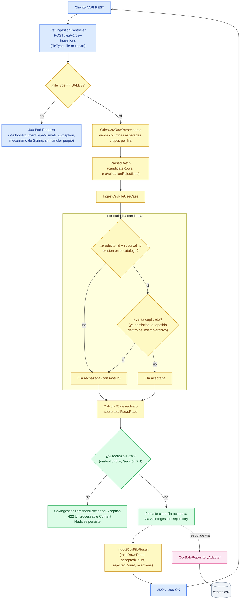

# Flujo de ingesta de archivos CSV (ventas)

Este documento representa exclusivamente el flujo **IMPLEMENTADO y verificable** del caso de uso `IngestCsvFileUseCase` (impl: `IngestCsvFileService`), verificado contra el código fuente actual. Hoy solo existe implementación para `CsvFileType.SALES` — es el único valor del enum; ingerir compras, inventario, productos, proveedores, categorías o sucursales está fuera de alcance de este flujo.

## Notas sobre el detalle omitido

- **`PARSE`** vive en `adapters/in/csv`, no en `application/`: valida estructura y tipos por fila (columnas esperadas, parseo de fecha/decimal/entero) apoyándose en el constructor de `Sale`, que ya verifica invariantes como `unidades_vendidas >= 0`. La integridad referencial y los duplicados quedan para la capa de aplicación, que sí tiene los puertos para resolverlos — de ahí la separación entre `PARSE` (fuera del use case) y `LOOP` (dentro).
- **`DUP`** colapsa dos chequeos independientes: `saleIngestionRepository.existsByProductStoreAndDate` (contra lo ya persistido) y una detección en memoria de duplicados dentro del mismo archivo subido (`seenInThisBatch`) — necesaria porque nada se persiste hasta el final de la corrida.
- El umbral del 5% se toma literalmente del ejemplo de la Sección 7.4 de `InventoryIQ_Documentacion.md`; no hay otro valor sugerido en la documentación, y es una constante fija en `IngestCsvFileService` (`REJECTION_THRESHOLD_PERCENT`), no configurable.
- Si se supera el umbral, la excepción se lanza **antes** del bloque de persistencia: es todo o nada por corrida, no hay persistencia parcial de las filas aceptadas hasta ese punto.
