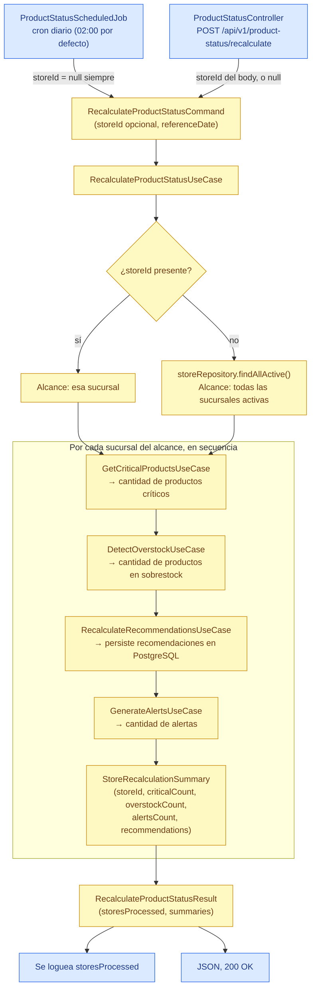

# Flujo de recálculo de estado de productos

Este documento representa exclusivamente el flujo **IMPLEMENTADO y verificable** del caso de uso `RecalculateProductStatusUseCase` (impl: `RecalculateProductStatusService`), verificado contra el código fuente actual. Es el orquestador final del proyecto: dispara, en secuencia, a `GetCriticalProductsUseCase`, `DetectOverstockUseCase`, `RecalculateRecommendationsUseCase` y `GenerateAlertsUseCase` por cada sucursal en alcance.

**Nota importante de alcance:** este caso de uso no persiste una tabla de "estado de producto" propia. El único efecto persistido real es el que ya cubre `RecalculateRecommendationsUseCase` (recomendaciones en PostgreSQL). Los otros tres casos de uso se recalculan al vuelo, igual que en el resto del proyecto — se corren acá para completar el resumen del job, no porque tengan un efecto secundario propio que persistir.

## Notas sobre el detalle omitido

- El orden `Critical → Overstock → RecalculateRecommendations → Alerts` es literal del cuerpo de `recalculateForStore` en `RecalculateProductStatusService`, no una inferencia.
- Cada uno de los cuatro pasos internos del loop es en sí mismo un caso de uso completo con su propio flujo de datos (ver `current-architecture.md`, Tabla 2, y `reorder-suggestions-flow.md` para el detalle de `GenerateReorderSuggestionsUseCase`, invocado a su vez por `RecalculateRecommendationsUseCase`).
- `referenceDate` nunca lo elige quien dispara el flujo: el job lo resuelve con `LocalDate.now(clock)` y el controller REST hace lo mismo — no es un parámetro de request en ningún trigger.
- No existe endpoint documentado en la Sección 8 de `InventoryIQ_Documentacion.md` para este caso de uso; `ProductStatusController` se diseñó en este slice para poder disparar el job manualmente, además del trigger programado real.
