# Flujo de generación de sugerencias de reposición

Este documento representa exclusivamente el flujo **IMPLEMENTADO y verificable** del caso de uso `GenerateReorderSuggestionsUseCase` (impl: `GenerateReorderSuggestionsService`), verificado directamente contra el código fuente actual del repositorio. No incluye pasos, cálculos ni componentes descritos en `docs/InventoryIQ_Documentacion.md` o `docs/InventoryIQ_Roadmap.md` que no tengan evidencia en el código (por ejemplo, EOQ no participa de este flujo, y este caso de uso no persiste ninguna recomendación).

```mermaid
flowchart TD
    CLI["Cliente / API REST"]
    CTRL["ReorderSuggestionsController<br/>GET /api/v1/reorder-suggestions<br/>storeId, categoryId?, supplierId?, referenceDate"]
    QRY["GenerateReorderSuggestionsQuery<br/>valida storeId y referenceDate no nulos<br/>(constructor compacto del record)"]
    BADREQ["InvalidDomainDataException<br/>→ GlobalExceptionHandler → 400 Bad Request"]
    UC["GenerateReorderSuggestionsUseCase<br/>impl: GenerateReorderSuggestionsService"]

    STEP1["productRepository.findAllActive()<br/>→ List&lt;Product&gt;"]
    FILTER["Filtra en memoria por<br/>Product.categoryId / Product.supplierId<br/>(solo si categoryId/supplierId vienen en la query)"]
    WINDOW["windowStart = referenceDate − 89 días<br/>(SALES_WINDOW_DAYS = 90, constante del Service)"]

    subgraph LOOP["Por cada Product del scope filtrado (bucle en GenerateReorderSuggestionsService.execute)"]
        direction TB
        SALES["saleRepository.findByProductAndStore(<br/>productId, storeId, windowStart, referenceDate)<br/>→ List&lt;Sale&gt;"]
        SNAP["inventoryRepository.findSnapshotsInRange(<br/>productId, storeId, windowStart−1, referenceDate)<br/>→ List&lt;Inventory&gt;"]
        ASSEMBLE["DailySalesRecordAssembler.assemble(sales, snapshots)<br/>→ List&lt;DailySalesRecord&gt;<br/>(stock de cierre del día anterior por venta)"]
        ADS["AdsCalculator.calculateCorrectedAds(dailyRecords)<br/>Sección 4.1/4.9 — excluye días con quiebre de stock<br/>→ ads (double)"]
        ADS_CHECK{"¿AdsCalculator lanzó<br/>InvalidDomainDataException?<br/>(sin historial suficiente)"}
        LATEST["inventoryRepository.findLatestSnapshotAsOf(<br/>productId, storeId, referenceDate)<br/>→ Optional&lt;Inventory&gt;"]
        LATEST_CHECK{"¿snapshot vigente<br/>presente?"}
        CAT["categoryRepository.findById(product.categoryId())<br/>→ Optional&lt;Category&gt;"]
        CAT_CHECK{"¿categoría<br/>encontrada?"}
        SAFETY["SafetyStockCalculator.calculateSimplifiedMethod(<br/>ads, category.defaultExtraCoverageDays())<br/>Sección 4.3 (método simplificado)<br/>→ SafetyStock"]
        ROP["ReorderPointCalculator.calculate(<br/>ads, product.leadTime(), safetyStock)<br/>Sección 4.4<br/>→ ReorderPoint"]
        COV["OverstockDetector.calculateCurrentDaysOfCoverage(<br/>currentStock, ads)<br/>Sección 4.8<br/>→ currentDaysOfCoverage (double)"]
        STATUS["ProductStatusEvaluator.evaluate(EvaluationContext)<br/>Sección 4.12<br/>→ ProductStatus<br/>(se calcula, pero no se usa para filtrar este flujo)"]
        INDICATORS["ProductIndicatorsCalculator.ProductIndicators<br/>(currentStock, stockInTransit, ads,<br/>safetyStock, reorderPoint, currentDaysOfCoverage, status)"]
        GATE{"ReorderPointCalculator.requiresReplenishment(<br/>currentStock, reorderPoint)?<br/>Sección 4.4 — regla de disparo:<br/>currentStock ≤ reorderPoint"}
        QTY["RecommendedQuantityCalculator.calculateByTargetCoverage(<br/>ads, 15 días, currentStock, stockInTransit)<br/>Sección 4.5 — método de cobertura objetivo<br/>(EOQ no se usa: requiere costos que no existen en ningún CSV)<br/>→ RecommendedQuantity"]
        DEADLINE["orderDeadlineDate = referenceDate + días hasta que<br/>el stock proyectado (decrece a razón de ads/día)<br/>cruce SafetyStock<br/>(si ads ≤ 0 → orderDeadlineDate = referenceDate)"]
        JUSTIF["justification: texto formateado con<br/>ADS, cobertura objetivo, stock actual/en tránsito,<br/>cantidad sugerida y fecha límite"]
        RESULT["ReorderSuggestionResult<br/>(productId, sku, productName, storeId, categoryId,<br/>supplierId = product.supplierId() tal cual,<br/>suggestedQuantity, orderDeadlineDate, justification)"]
        DISCARD["Producto omitido de la respuesta<br/>(Optional.empty(); el bucle continúa<br/>con el siguiente producto)"]

        SALES --> ASSEMBLE
        SNAP --> ASSEMBLE
        ASSEMBLE --> ADS
        ADS --> ADS_CHECK
        ADS_CHECK -->|"sí, sin historial suficiente"| DISCARD
        ADS_CHECK -->|"no, ads calculado"| LATEST
        LATEST --> LATEST_CHECK
        LATEST_CHECK -->|"no"| DISCARD
        LATEST_CHECK -->|"sí"| CAT
        CAT --> CAT_CHECK
        CAT_CHECK -->|"no"| DISCARD
        CAT_CHECK -->|"sí"| SAFETY
        SAFETY --> ROP
        ROP --> COV
        COV --> STATUS
        STATUS --> INDICATORS
        INDICATORS --> GATE
        GATE -->|"no"| DISCARD
        GATE -->|"sí"| QTY
        QTY --> DEADLINE
        DEADLINE --> JUSTIF
        JUSTIF --> RESULT
    end

    LIST["List&lt;ReorderSuggestionResult&gt;<br/>(results::add por cada producto no descartado)"]
    MAP["ReorderSuggestionResponseMapper.toResponse(...)<br/>adapters.in.rest.mapper"]
    RESP["List&lt;ReorderSuggestionResponse&gt;<br/>JSON, 200 OK"]

    subgraph SALIDA_CSV["Adaptadores de Salida — CSV (detrás de los Output Ports)"]
        direction TB
        A_Prod["CsvProductRepositoryAdapter<br/>lee productos.csv"]
        A_Sale["CsvSaleRepositoryAdapter<br/>lee ventas.csv"]
        A_Inv["CsvInventoryRepositoryAdapter<br/>lee inventario.csv"]
        A_Cat["CsvCategoryRepositoryAdapter<br/>lee categorias.csv"]
        CSVFILES[("data/csv/*.csv")]
    end

    CLI --> CTRL
    CTRL --> QRY
    QRY -.->|"storeId o referenceDate nulos"| BADREQ
    QRY --> UC
    UC --> STEP1
    STEP1 --> FILTER
    FILTER --> WINDOW
    WINDOW --> SALES
    WINDOW --> SNAP
    RESULT --> LIST
    LIST --> MAP
    MAP --> RESP
    RESP --> CLI

    STEP1 -.->|"responde vía"| A_Prod
    SALES -.->|"responde vía"| A_Sale
    SNAP -.->|"responde vía"| A_Inv
    LATEST -.->|"responde vía"| A_Inv
    CAT -.->|"responde vía"| A_Cat
    A_Prod --> CSVFILES
    A_Sale --> CSVFILES
    A_Inv --> CSVFILES
    A_Cat --> CSVFILES

    classDef entrada fill:#dbeafe,stroke:#2563eb,color:#1e3a8a;
    classDef aplicacion fill:#fef9c3,stroke:#ca8a04,color:#713f12;
    classDef dominio fill:#dcfce7,stroke:#16a34a,color:#14532d;
    classDef salida fill:#fce7f3,stroke:#db2777,color:#831843;
    classDef infra fill:#f1f5f9,stroke:#64748b,color:#0f172a;

    class CLI,CTRL,BADREQ,MAP,RESP entrada;
    class QRY,UC,STEP1,FILTER,WINDOW,SALES,SNAP,LATEST,CAT,ADS_CHECK,LATEST_CHECK,CAT_CHECK,INDICATORS,DEADLINE,JUSTIF,RESULT,DISCARD,LIST aplicacion;
    class ASSEMBLE,ADS,SAFETY,ROP,COV,STATUS,GATE,QTY dominio;
    class A_Prod,A_Sale,A_Inv,A_Cat salida;
    class CSVFILES infra;
```

