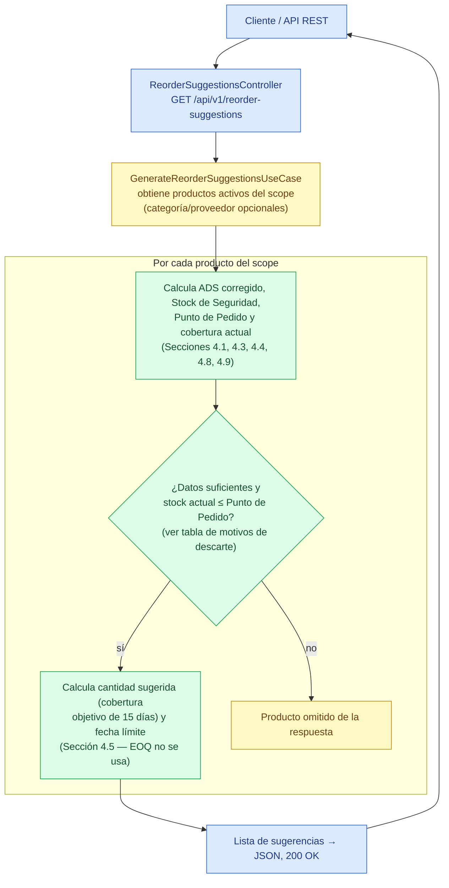

# Flujo de generación de sugerencias de reposición

Este documento representa exclusivamente el flujo **IMPLEMENTADO y verificable** del caso de uso `GenerateReorderSuggestionsUseCase` (impl: `GenerateReorderSuggestionsService`), verificado contra el código fuente actual. No incluye pasos ni cálculos descritos en `docs/InventoryIQ_Documentacion.md` sin evidencia en código (por ejemplo, EOQ no participa de este flujo, y este caso de uso no persiste ninguna recomendación).

## Motivos de descarte

El nodo `GATE` colapsa cuatro condiciones independientes que en el código son chequeos separados, pero todas producen el mismo efecto (el producto no aparece en la respuesta):

| Condición evaluada | Efecto |
|---|---|
| `AdsCalculator` sin historial de ventas suficiente | Descartado |
| Sin snapshot de inventario vigente (`findLatestSnapshotAsOf`) | Descartado |
| Categoría del producto no encontrada | Descartado |
| Stock actual > Punto de Pedido (`ReorderPointCalculator.requiresReplenishment` = false) | Descartado (no requiere reposición) |

Este último caso es la regla de disparo exacta de la Sección 4.4: `stock actual ≤ punto de pedido`. Los otros tres son casos de datos insuficientes que impiden calcular con confianza.

## Acceso a datos

`CALC` obtiene ventas y snapshots de inventario de los últimos 90 días, y `UC`/`CALC` consultan productos y categorías, todo a través de los Output Ports listados en `current-architecture.md` (Tabla 3) — resueltos hoy por los adaptadores CSV (`productos.csv`, `categorias.csv`, `ventas.csv`, `inventario.csv`).

## Notas sobre el detalle omitido

- **`CALC`** colapsa la construcción del historial diario (`DailySalesRecordAssembler`) y cuatro cálculos secuenciales: `AdsCalculator`, `SafetyStockCalculator.calculateSimplifiedMethod`, `ReorderPointCalculator.calculate` y `OverstockDetector.calculateCurrentDaysOfCoverage`. También se calcula `ProductStatusEvaluator.evaluate`, aunque este flujo no lo usa para filtrar.
- La validación de `storeId`/`referenceDate` nulos en `GenerateReorderSuggestionsQuery` (→ 400 Bad Request) y el detalle de `RecommendedQuantityCalculator.calculateByTargetCoverage` (Sección 4.5) se documentan aquí en texto en lugar de como nodos propios.
- El `supplierId` del resultado se propaga tal cual desde `Product.supplierId()`, sin resolverlo contra un `SupplierRepository` (ese puerto no existe en el repositorio).
